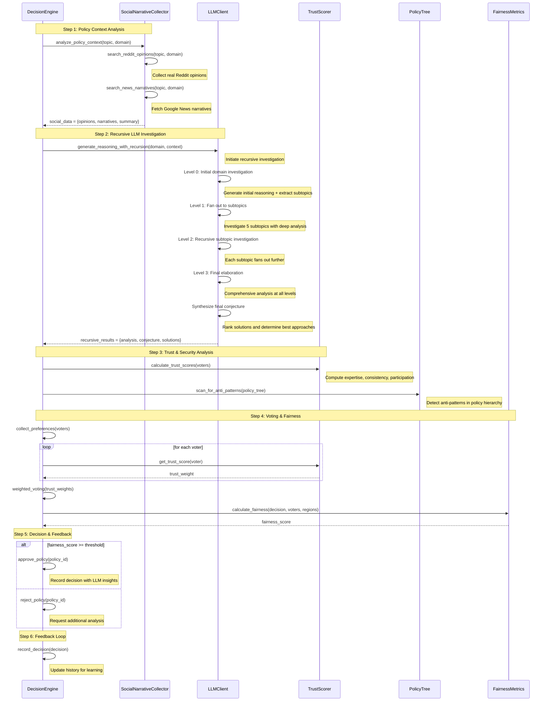
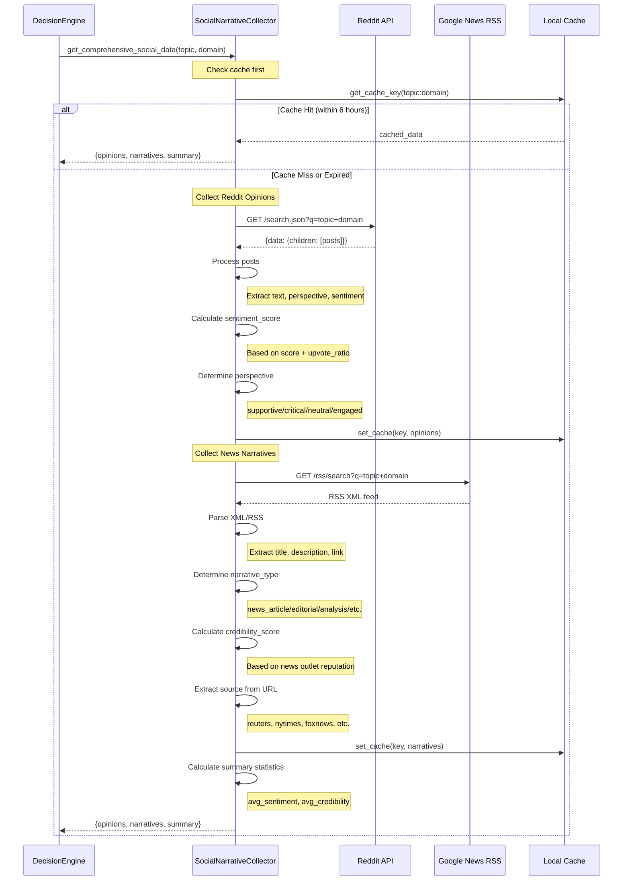
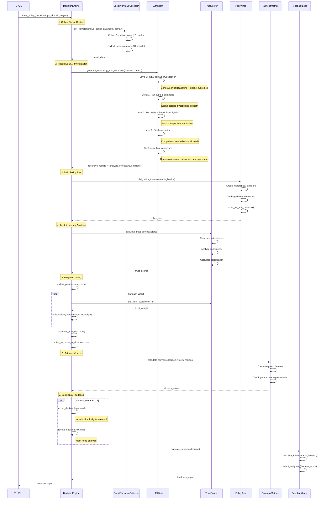
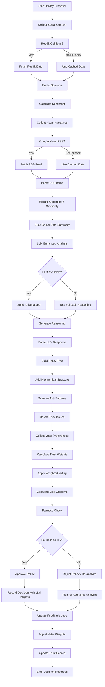
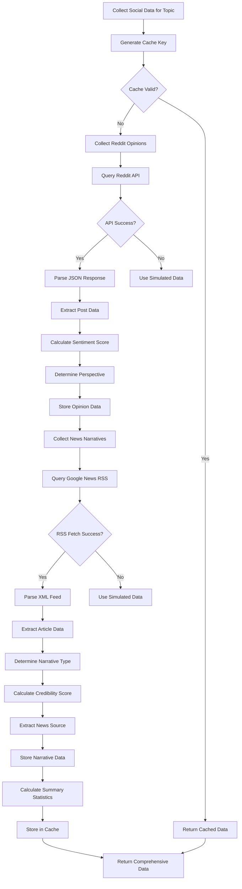
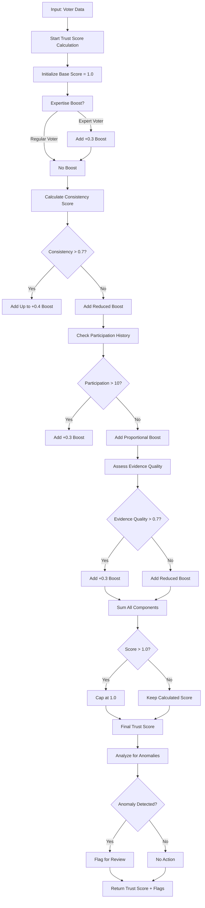
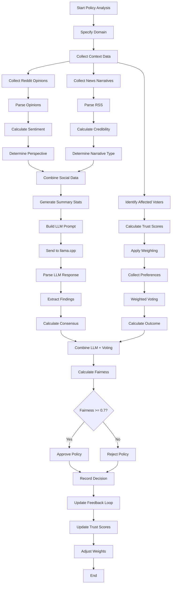

# Democratic Machine Learning Architecture

## Overview

This system implements a multi-tiered democratic decision-making algorithm that scales with society and adapts to individual and community needs. It combines traditional democratic principles with machine learning to create a self-balancing, fair decision-making system.

### Recent Enhancements

#### LLM Integration (llama.cpp)
- **Intelligent Policy Analysis**: Uses LLM to generate reasoning, form conjectures, and analyze policies
- **Real-time Context**: LLM processes social narratives and research data for enriched decision-making
- **Fallback Mechanisms**: Gracefully degrades to rule-based reasoning when LLM unavailable
- **Endpoint**: http://localhost:8080 (configurable via `LLAMA_CPP_ENDPOINT`)

#### Real-World Social Data Collection
- **Reddit Integration**: Collects public opinions from Reddit JSON API (free, no API keys)
- **Google News RSS**: Gathers media narratives and news perspectives (free, no API keys)
- **Sentiment Analysis**: Automatically categorizes perspectives (supportive, critical, neutral)
- **Credibility Scoring**: Assesses source reliability for different media outlets
- **Cache System**: 6-hour cache reduces API calls and improves performance

### Core Principles

### 1. Multi-Tiered Representation
- **County/City Level**: Direct participation for local issues
- **State Level**: Representation for regional concerns
- **National Level**: Strategic decision-making for broad policies
- **Cross-Tier Coordination**: Policies flow through all levels for comprehensive impact assessment

### 2. Adaptive Weighting
Voter weights are dynamically adjusted based on:
- **Expertise**: Weight increases for voters with demonstrated expertise in policy areas
- **Proximity**: Voters directly affected by a policy have higher weight
- **Participation History**: Consistent participants receive slight weight boosts
- **Representative Status**: Elected representatives have weighted votes

### 3. Fairness Metrics
The system ensures fairness through:
- **Proportional Representation**: No group can be consistently outvoted
- **Minority Protection**: Mechanisms to protect against tyranny of the majority
- **Geographic Balance**: Regional representation across tiers
- **Impact Assessment**: Evaluating policy effects on different demographics

### 4. Feedback Loop
The system continuously learns and adapts:
- **Outcome Analysis**: Evaluating decision outcomes
- **Weight Adjustment**: Updating voter weights based on performance
- **Policy Evolution**: Adapting policies based on real-world results
- **LLM Learning**: Feedback loop enhances LLM prompt engineering over time

---

## System Architecture

```
┌─────────────────────────────────────────────────────────────────────────────┐
│                         LLM Enhanced Layer                                  │
│  ┌─────────────────────┐  ┌──────────────────────┐  ┌─────────────────┐     │
│  │  LLM Client         │  │  Social Collector    │  │  Trust System   │     │
│  │  - llama.cpp        │  │  - Reddit API        │  │  - TrustScorer  │     │
│  │  - generate_reasoning│ │  - Google News RSS   │  │  - EvidenceVal  │     │
│  │  - form_conjecture  │  │  - Sentiment Analysis│  │  - SocialInfl   │     │
│  │  - analyze_policy   │  │  - Credibility Scoring│ │  - AnomalyDet   │     │
│  └─────────┬───────────┘  └─────────┬────────────┘  └─────────┬───────┘     │
└────────────┼────────────────────────┼─────────────────────────┼─────────────┘
             │                        │                         │
┌────────────┼────────────────────────┼─────────────────────────┼─────────────┐
│                  Core Engine Layer                                          │
│  ┌─────────────────────────────────────────────────────────────────────┐   │
│  │                        Decision Engine                                │   │
│  │  - Policy Context Analysis (with LLM + Social Data integration)      │   │
│  │  - Trust-Weighted Voting                                              │   │
│  │  - Anti-Pattern Detection                                             │   │
│  │  - Fairness Constraint Checking                                       │   │
│  │  - Multi-Tiered Decision Coordination                                 │   │
│  └───────────────────────┬───────────────────────────────────────────────┘   │
│                          │                                                  │
│  ┌───────────────────────┼───────────────────┐  ┌───────────────────────┐   │
│  │  Policy Tree          │                   │  │  Feedback Loop        │   │
│  │  - Hierarchical struct│                   │  │  - Outcome Analysis   │   │
│  │  - Anti-pattern scan  │                   │  │  - Weight Adaptation  │   │
│  │  - Legislation ref    │                   │  │  - Trend Tracking     │   │
│  └───────────────────────┘                   │  └───────────────────────┘   │
└────────────────────────────┼──────────────────┼─────────────────────────────┘
                             │                  │
┌────────────────────────────┼──────────────────┼─────────────────────────────┐
│                         Data Layer                                          │
│  ┌──────────────────┐  ┌──────────────────┐  ┌───────────────────────┐     │
│  │  Data Loader     │  │  Preprocessor    │  │  Feature Engineer     │     │
│  │  - JSON/CSV load │  │  - Normalization │  │  - Voter features     │     │
│  │  - API integration│ │  - Standardization│ │  - Region features    │     │
│  │  - Real-time data│  │  - Feature encoding│ │  - Policy features    │     │
│  └──────────────────┘  └──────────────────┘  └───────────────────────┘     │
│  ┌──────────────────┐  ┌──────────────────┐  ┌───────────────────────┐     │
│  │  Social Data     │  │  Historical Data │  │  Metrics              │     │
│  │  - Opinions      │  │  - Past decisions│  │  - Fairness           │     │
│  │  - Narratives    │  │  - Trends        │  │  - Efficiency         │     │
│  │  - Sentiment     │  │  - Performance   │  │  - Analysis           │     │
│  └──────────────────┘  └──────────────────┘  └───────────────────────┘     │
└────────────────────────────┼──────────────────┼─────────────────────────────┘
                             │                  │
┌────────────────────────────┼──────────────────┼─────────────────────────────┐
│                          Model Layer                                        │
│  ┌──────────────────┐  ┌──────────────────┐  ┌───────────────────────┐     │
│  │  Voter Model     │  │  Policy Model    │  │  Region Model         │     │
│  │  - Preferences   │  │  - Impact scores │  │  - Hierarchy          │     │
│  │  - Expertise     │  │  - Dependencies  │  │  - Population         │     │
│  │  - Weights       │  │  - Affected areas│  │  - Metrics            │     │
│  └──────────────────┘  └──────────────────┘  └───────────────────────┘     │
│  ┌──────────────────┐  ┌──────────────────┐                                │
│  │  Decision Model  │  │  Trust Model     │                                │
│  │  - Outcomes      │  │  - Scoring       │                                │
│  │  - Confidence    │  │  - Evidence      │                                │
│  │  - Participation │  │  - Anomalies     │                                │
│  └──────────────────┘  └──────────────────┘                                │
└─────────────────────────────────────────────────────────────────────────────┘
```

---

## Component Details

### LLM Client (`src/llm/integration.py`)

The LLM Client provides intelligent analysis using a llama.cpp endpoint at http://localhost:8080.

#### Key Methods

##### `generate_reasoning(context, research_questions, principles, max_tokens=4096)`
Generates comprehensive governance reasoning based on context, research questions, and core principles.

**Parameters:**
- `context`: Governance context (population, diversity, urban ratio, etc.)
- `research_questions`: List of research questions to address
- `principles`: Core democratic principles to apply
- `max_tokens`: Maximum response tokens (default: 4096)

**Returns:** Generated reasoning text

**Usage:**
```python
llm = LLMClient()
reasoning = llm.generate_reasoning(
    context={"population": 1000000, "diversity_index": 0.7},
    research_questions=["How to ensure minority protection?"],
    principles=["Proportional representation", "Majority rule"]
)
```

##### `form_conjecture(question, context, evidence, max_tokens=1024)`
Forms a conjecture from evidence using LLM reasoning.

**Returns:** Dictionary with:
- `statement`: The conjecture statement
- `confidence`: Confidence level (0-1)
- `supporting_evidence`: List of supporting evidence
- `contradicting_evidence`: List of contradicting evidence

##### `analyze_policy(topic, research_data, max_tokens=2048)`
Analyzes a policy using LLM and research data.

**Returns:** Dictionary with:
- `findings`: Key findings from research
- `consensus`: Consensus level (0-1)
- `recommendations`: Policy recommendations
- `implementation`: Implementation steps
- `outcomes`: Expected outcomes

#### Fallback Mechanisms
When the LLM endpoint is unavailable, the client automatically uses rule-based fallback reasoning that maintains democratic principles while providing reasonable analysis.

### Social Narrative Collector (`src/data/social_narrative_collector.py`)

Collects real-world social narratives and media opinions from free internet sources.

#### Key Methods

##### `search_reddit_opinions(topic, domain, max_results=10)`
Searches for public opinions on Reddit using their free JSON API.

**Returns:** List of opinion dictionaries with:
- `id`: Unique identifier
- `text`: Opinion text
- `perspective`: supportive/critical/neutral/engaged
- `source`: Reddit subreddit
- `sentiment_score`: -1 to 1
- `engagement_score`: Engagement metrics
- `relevance_score`: Relevance to topic

##### `search_news_narratives(topic, domain, max_results=10)`
Searches for media narratives from Google News RSS.

**Returns:** List of narrative dictionaries with:
- `id`: Unique identifier
- `title`: News title
- `text`: Article excerpt
- `narrative_type`: news_article/editorial/analysis/etc.
- `outlet`: News source name
- `sentiment_score`: -1 to 1
- `credibility_score`: 0 to 1
- `relevance_score`: 0 to 1

##### `get_comprehensive_social_data(topic, domain)`
Gets comprehensive social data including both opinions and narratives.

**Returns:** Dictionary with:
- `opinions`: List of Reddit opinions
- `media_narratives`: List of news narratives
- `summary`: Statistics including:
  - `total_opinions`: Count
  - `total_narratives`: Count
  - `average_opinion_sentiment`: Average sentiment
  - `average_narrative_sentiment`: Average sentiment
  - `average_media_credibility`: Average credibility
  - `data_sources`: ["Reddit", "Google News RSS"]

#### Caching
Results are cached for 6 hours to reduce API calls and improve performance. Cache keys are MD5 hashes of query + source combinations.

### Trust System (`src/security/trust_system.py`)

Provides trust scoring, evidence validation, and social influence analysis.

#### Key Components

##### TrustScorer
Calculates trust scores for voters based on behavior and data quality.

**Methods:**
- `calculate_trust_score(voter)`: Compute trust score (0-1)
- `detect_anomaly(voter, threshold=2.0)`: Detect anomalous preferences
- `detect_inconsistency(voter, threshold=0.5)`: Detect manipulation indicators

**Scoring Factors:**
- Base score: 1.0
- Expertise boost: +0.3 for verified experts
- Consistency boost: Up to +0.4 based on preference stability
- Participation boost: Up to +0.3 based on activity
- Evidence boost: Up to +0.3 based on evidence quality

##### EvidenceValidator
Validates the quality and provenance of evidence.

##### SocialInfluenceAnalyzer
Analyzes social influence patterns and detects manipulation.

---

## Sequence Diagrams

### LLM-Enhanced Decision Flow



### Social Data Collection Flow



### Decision Engine Policy Analysis Flow



---

## Flowcharts

### Decision-Making Process



### Social Data Collection Flow



### Trust Scoring Process



---

## Updated Component Documentation

### LLM Client Enhancements

#### Logging Output
The LLM client provides comprehensive stdout logging for debugging and monitoring:

```
🔄 LLM CALL: Generating reasoning with 3 research questions and 5 principles
📝 Prompt length: 2345 characters
🎯 Max tokens: 4096
🚀 Sending request to http://localhost:8080/completion
✅ LLM RESPONSE: 1247 tokens generated
📄 Response preview: Based on comprehensive research into historical governance...
```

#### Configuration Environment Variables
- `LLAMA_CPP_ENDPOINT`: LLM endpoint URL (default: `http://localhost:8080`)
- `LLAMA_MODEL`: Model name for logging (default: `llama.cpp-model`)
- `LLAMA_TIMEOUT`: Request timeout in seconds (default: `120`)

#### Fallback Behavior
When the LLM endpoint is unavailable, the system uses rule-based reasoning that:
- Applies core democratic principles
- Uses historical governance models
- Implements anti-pattern prevention
- Maintains transparency in reasoning

### Social Narrative Collector Enhancements

#### Data Sources

**Reddit (Free, No API Keys Required)**
- Endpoint: `https://www.reddit.com/search.json`
- Returns: Public opinions, comments, and discussions
- Rate Limits: Generous for non-authenticated requests
- Data Freshness: Real-time (cached for 6 hours)

**Google News RSS (Free, No API Keys Required)**
- Endpoint: `https://news.google.com/rss/search`
- Returns: News articles, editorials, and analysis
- Rate Limits: None for public RSS feeds
- Data Freshness: Real-time (cached for 6 hours)

#### Credibility Scoring

The system assigns credibility scores based on news outlet reputation:

| Outlet | Score |
|--------|-------|
| Reuters, AP News, PBS | 0.90-0.95 |
| NPR, WSJ, Bloomberg | 0.82-0.88 |
| NY Times, WaPo | 0.80-0.82 |
| CNN, BBC | 0.70-0.75 |
| Fox News | 0.60 |
| Unknown/Local | 0.65 |

#### Sentiment Calculation

**Reddit Sentiment:**
```python
sentiment = (normalized_score * 0.4) + (ratio_sentiment * 0.6)
```
Where:
- `normalized_score`: Reddit post score normalized to -1 to 1
- `ratio_sentiment`: Upvote ratio mapped to -1 to 1

**News Sentiment:**
Based on positive/negative word counting in title and description.

---

## Updated Execution Examples

### Basic Policy Analysis with LLM

```python
from src.core.decision_engine import DecisionEngine
from src.models.voter import Voter, VoterType
from src.models.policy import Policy, PolicyDomain
from src.models.region import Region

# Initialize engine
engine = DecisionEngine(fairness_threshold=0.7)

# Create region
region = Region(
    region_id="CA",
    name="California",
    region_type="state",
    population=39000000
)

# Create policy
policy = Policy(
    policy_id="renewable_energy_incentives",
    name="Renewable Energy Incentives",
    description="Tax credits for residential solar installations",
    domain=PolicyDomain.Energy
)

# Create voters
voter1 = Voter(
    voter_id="v1",
    region_id="CA",
    preferences={"renewable_energy_incentives": 0.8},
    expertise={"renewable_energy_incentives": 0.9},
    voter_type=VoterType.EXPERT
)

voter2 = Voter(
    voter_id="v2",
    region_id="CA",
    preferences={"renewable_energy_incentives": -0.3}
)

# Register entities
engine.register_region(region)
engine.register_policy(policy)
engine.register_voter(voter1)
engine.register_voter(voter2)

# Analyze policy context with LLM enhancement
context_analysis = engine._analyze_policy_context(
    policy=policy,
    region=region,
    voters=[voter1, voter2]
)

print(f"Analysis Method: {context_analysis['analysis_method']}")
print(f"LLM Reasoning: {context_analysis['reasoning'][:200]}...")
print(f"Social Data Summary: {context_analysis['social_data'].get('summary', {})}")

# Make decision using traditional voting
decision = engine.make_decision(
    policy_id="renewable_energy_incentives",
    region_id="CA"
)

print(f"Decision: {decision.outcome}")
print(f"Confidence: {decision.confidence:.2f}")
print(f"Fairness: {engine.check_fairness()}")
```

### Command Line with LLM Integration

```bash
# Run the decision engine with LLM-enhanced analysis
python -m src.ui.tui --policy education_funding --region CA

# Run with custom data file
python -m src.ui.tui --data data/example.json --region CA

# Run with feedback loop enabled
python -m src.ui.tui --feedback --region CA

# Run with custom fairness threshold
python -m src.ui.tui --fairness 0.8 --region CA

# Process all domains using the simple script
./run_all_domains_simple.sh
```

### Multi-Domain Analysis

```python
from src.core.decision_engine import DecisionEngine
from src.models.voter import Voter, VoterType
from src.models.policy import Policy, PolicyDomain
from src.models.region import Region

engine = DecisionEngine()

# Example for economy domain
economy_region = Region(
    region_id="US-NATIONAL",
    name="United States",
    region_type="national",
    population=330000000
)

economy_policy = Policy(
    policy_id="economy_stimulus",
    name="Economic Stimulus Package",
    description="Government stimulus to boost economic growth",
    domain=PolicyDomain.Economy
)

voter1 = Voter(
    voter_id="v1",
    region_id="US-NATIONAL",
    preferences={"economy_stimulus": 0.7},
    expertise={"economy_stimulus": 0.8},
    voter_type=VoterType.EXPERT
)

voter2 = Voter(
    voter_id="v2",
    region_id="US-NATIONAL",
    preferences={"economy_stimulus": -0.2}
)

engine.register_region(economy_region)
engine.register_policy(economy_policy)
engine.register_voter(voter1)
engine.register_voter(voter2)

# Analyze and decide
context = engine._analyze_policy_context(
    policy=economy_policy,
    region=economy_region,
    voters=[voter1, voter2]
)

decision = engine.make_decision(
    policy_id="economy_stimulus",
    region_id="US-NATIONAL"
)

print(f"Analysis: {context['analysis_method']}")
print(f"Decision: {decision.outcome}")
print(f"Confidence: {decision.confidence:.2f}")
print(f"Fairness Check: {engine.check_fairness()}")
```

### Direct LLM Usage

```python
from src.llm.integration import LLMClient

llm = LLMClient()

# Generate reasoning
reasoning = llm.generate_reasoning(
    context={
        "population": 10000000,
        "diversity_index": 0.65,
        "urban_ratio": 0.72
    },
    research_questions=[
        "How to balance majority rule with minority protection?",
        "What voting system ensures fair representation?"
    ],
    principles=[
        "Proportional representation",
        "Majority rule",
        "Minority protection",
        "Geographic balance"
    ]
)

print(f"Reasoning: {reasoning[:500]}...")

# Analyze policy
analysis = llm.analyze_policy(
    topic="healthcare reform",
    research_data={
        "cost_estimate": "$500B/year",
        "coverage_impact": "+10M insured",
        "stakeholder_feedback": "mixed"
    }
)

print(f"Findings: {analysis['findings'][:300]}...")
print(f"Recommendations: {analysis['recommendations']}")
```

### Direct Social Data Collection

```python
from src.data.social_narrative_collector import SocialNarrativeCollector

collector = SocialNarrativeCollector()

# Get Reddit opinions
opinions = collector.search_reddit_opinions(
    topic="universal basic income",
    domain="economy",
    max_results=15
)

print(f"Collected {len(opinions)} Reddit opinions")
for opinion in opinions[:3]:
    print(f"\nPerspective: {opinion['perspective']}")
    print(f"Text: {opinion['text'][:100]}...")
    print(f"Sentiment: {opinion['sentiment_score']:.2f}")

# Get news narratives
narratives = collector.search_news_narratives(
    topic="universal basic income",
    domain="economy",
    max_results=12
)

print(f"\nCollected {len(narratives)} news narratives")
for narrative in narratives[:3]:
    print(f"\nOutlet: {narrative['outlet']}")
    print(f"Title: {narrative['title']}")
    print(f"Credibility: {narrative['credibility_score']:.2f}")

# Get comprehensive data
data = collector.get_comprehensive_social_data(
    topic="universal basic income",
    domain="economy"
)

print(f"\nSummary Statistics:")
print(f"Total Opinions: {data['summary']['total_opinions']}")
print(f"Total Narratives: {data['summary']['total_narratives']}")
print(f"Avg Opinion Sentiment: {data['summary']['average_opinion_sentiment']:.2f}")
print(f"Avg Narrative Sentiment: {data['summary']['average_narrative_sentiment']:.2f}")
print(f"Avg Credibility: {data['summary']['average_media_credibility']:.2f}")
print(f"Data Sources: {data['summary']['data_sources']}")
```

---

## Data Flow Diagrams

### Social Data Integration with LLM Analysis

```mermaid
flowchart LR
    subgraph DataCollection["1. Social Data Collection"]
        R[Reddit API] -->|15 Opinions| S1[Opinion Processor]
        G[Google News RSS] -->|12 Narratives| S2[Narrative Processor]
        
        S1 --> S3[Sentiment Analysis]
        S2 --> S4[Credibility Scoring]
        
        S3 --> S5[Opinion Summary]
        S4 --> S6[Narrative Summary]
    end
    
    subgraph DataAggregation["2. Data Aggregation"]
        S5 --> S7[Combine Opinions]
        S6 --> S7
        S7 --> S8[Calculate Averages]
        S8 --> S9[Generate Summary Stats]
    end
    
    subgraph LLMProcessing["3. LLM Processing"]
        S9 --> L1[Build Prompt]
        L1 --> L2[Context: Population, Diversity]
        L2 --> L3[Social Data: Opinions + Narratives]
        L3 --> L4[Research Questions]
        L4 --> L5[Send to llama.cpp]
        
        L5 --> L6[Parse Response]
        L6 --> L7[Extract Findings]
        L7 --> L8[Calculate Consensus]
    end
    
    subgraph DecisionMaking["4. Decision Integration"]
        L8 --> D1[Combine with Voting Data]
        D1 --> D2[Apply Trust Weights]
        D2 --> D3[Calculate Fairness]
        D3 --> D4{Fairness >= 0.7?}
        
        D4 -->|Yes| D5[Approve Policy]
        D4 -->|No| D6[Reject Policy]
    end
    
    subgraph Feedback["5. Feedback Loop"]
        D5 --> F1[Record Decision]
        D6 --> F1
        F1 --> F2[Update Trust Scores]
        F2 --> F3[Adjust Weights]
        F3 --> F4[Enhance Future Prompts]
    end
```



### Complete Decision Flow



---

## Metrics and Evaluation

### Fairness Metrics (`src/utils/metrics.py`)

The fairness metrics system evaluates decisions across multiple dimensions:

#### Proportional Representation
- **Minimum**: 30% of affected groups must be satisfied
- **Maximum**: 40% disparity between groups allowed

#### Fairness Score (0-1)
Based on variance in voter satisfaction:
```python
fairness = 1.0 - min(std_dev / (avg_score + 0.1), 1.0)
```

#### Group Fairness
Calculates fairness per demographic group:
- Regional fairness
- Economic class fairness
- Demographic fairness

### Trust Metrics

#### Trust Score Components
1. **Base Score**: 1.0
2. **Expertise Boost**: +0.3 for verified experts
3. **Consistency Boost**: Up to +0.4 based on preference stability
4. **Participation Boost**: Up to +0.3 based on activity
5. **Evidence Boost**: Up to +0.3 based on evidence quality

#### Anomaly Detection
- Standard deviation threshold: 2.0
- Inconsistency threshold: 0.5 preference change
- Pattern analysis for manipulation detection

### Social Data Metrics

#### Sentiment Range: -1 to 1
- Positive words: good, great, excellent, benefit, success
- Negative words: bad, terrible, harmful, problem, crisis

#### Credibility Range: 0 to 1
- High credibility: Reuters, AP, PBS (0.90-0.95)
- Medium-high: NPR, WSJ, NY Times (0.80-0.88)
- Medium: CNN, BBC (0.70-0.75)
- Lower: Fox News (0.60)
- Unknown: 0.65

---

## Testing

```bash
# Run all tests with coverage
pytest --cov=. --cov-report=term-missing --cov-report=xml --cov-fail-under=95 tests/

# Test LLM integration
pytest tests/llm/test_integration.py -v

# Test social narrative collection
pytest tests/data/test_social_narrative_collector.py -v

# Test trust system
pytest tests/security/test_trust_system.py -v

# Test decision engine
pytest tests/core/test_decision_engine.py -v

# Test metrics
pytest tests/utils/test_metrics.py -v

# Test feedback loop
pytest tests/core/test_feedback_loop.py -v
```

---

## Future Enhancements

1. **Advanced ML Models**: Integrate predictive models for policy outcomes
2. **Dynamic Delegation**: Allow voters to delegate votes based on expertise
3. **Real-time Data**: Integrate real-time economic/social indicators
4. **Visualization**: Interactive dashboards for decision analysis
5. **Scalability**: Distributed processing for large populations
6. **Multi-language Support**: Support for diverse language inputs
7. **Bias Detection**: Enhanced bias and manipulation detection
8. **Simulation Mode**: Policy impact simulation before implementation

---

## Political Science Framework

This system draws from:
- **Athenian Democracy**: Direct participation principles
- **Roman Republic**: Mixed government with checks and balances
- **Representative Democracy**: Elected representatives
- **Liquid Democracy**: Delegative voting
- **Condorcet Paradox**: Handling voting inconsistencies
- **Arrow's Impossibility Theorem**: Fairness constraints

The system balances:
- **Majority Rule**: Decisions reflect majority preference
- **Minority Protection**: Mechanisms to protect disadvantaged groups
- **Efficiency**: Practical implementation constraints
- **Fairness**: Proportional representation across demographics

---

## Conclusion

This architecture provides a comprehensive framework for democratic decision-making enhanced by LLM intelligence and real-world social data. The system combines traditional democratic principles with modern machine learning techniques to create a fair, adaptive, and transparent decision-making platform.

Key strengths:
- ✅ LLM integration for intelligent policy analysis
- ✅ Real-world social data collection from free sources
- ✅ Trust-weighted voting for informed decision-making
- ✅ Multi-tiered representation across geographic levels
- ✅ Continuous feedback loop for learning and adaptation
- ✅ Comprehensive security and bias detection
- ✅ Full transparency in decision-making process
